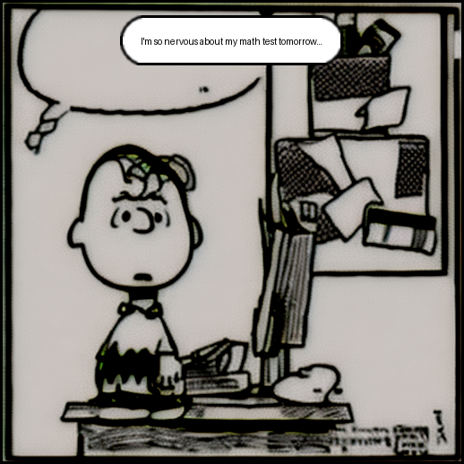
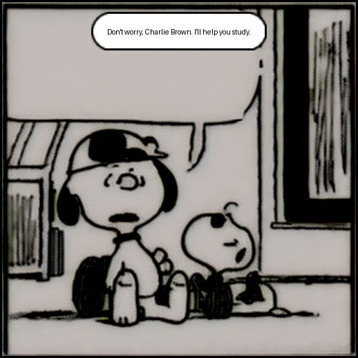

# AI-Powered Peanuts Comic Generator

This project presents a fully automated pipeline to generate multi-panel Peanuts-style comic strips using a combination of:

- LLaMA 3 (via Ollama) for story and dialogue generation  
- A fine-tuned Stable Diffusion model trained on Peanuts comics (via DreamBooth)  
- Speech bubble insertion and panel layout  
- Visual and narrative evaluation of output comics

> **Note**: The trained Stable Diffusion model is too large to upload to GitHub. You can download it from our shared Google Drive:  
[Model Folder – Google Drive](https://drive.google.com/drive/folders/1kYDbtPD4-_ixHU4coAJHIEN_w2HkqEXj?usp=drive_link)

---

## 📁 Project Structure

```
 ai-storyboard-gen/
├── dreambooth_train_cleaned.py         # Fine-tunes Stable Diffusion on Peanuts-style panels
├── gen_with_llm_3.py                   # Main script for end-to-end comic generation
├── evaluator.py                        # Panel consistency and quality evaluation
├── peanuts_finetuned_sd_no_text/      # (Download from Drive) Fine-tuned SD model
├── comic_panels/                       # Output directory for generated panels
├── comic_videos/                       # Output directory for video slideshows
├── results/                            # Evaluation outputs
└── README.md                           # This file
```

---

## Project Summary

This system fuses the semantic power of LLMs with the creative flexibility of diffusion models to generate Peanuts-style comics with minimal input. It handles:

- Natural language prompt ➝ narrative breakdown  
- Scene generation ➝ stylized panel creation  
- Character-consistent dialogues ➝ rendered into speech bubbles  
- Assembly of full comic strip or video

---

## Model & Pipeline Overview

1. **LLaMA 3**: Decomposes your prompt into a structured JSON of scenes and panel-wise dialogue  
2. **Stable Diffusion 2.1 (fine-tuned)**: Trained on Peanuts panels (text-free) using `dreambooth_train_cleaned.py`  
3. **Speech Bubbles**: Auto-rendered using PIL, placed dynamically with adaptive layout  
4. **Evaluator**: Computes SSIM (visual consistency), contrast, and optionally collects feedback

---

## Quickstart

### 1. Clone + Setup

```bash
git clone git@github.com:AmruthDevineni/ai-storyboard-gen.git
cd ai-storyboard-gen
pip install -r requirements.txt
```

---

### 2. Download the Fine-Tuned Model

Grab the folder from this Google Drive link and place it in the root directory:  
[peanuts_finetuned_sd_no_text – Google Drive](https://drive.google.com/drive/folders/1kYDbtPD4-_ixHU4coAJHIEN_w2HkqEXj?usp=drive_link)

---

### 3. Generate a Comic Strip

```bash
python gen_with_llm_3.py \
  --theme "Charlie Brown builds a birdhouse" \
  --panels 6 \
  --run_evaluation
```

This:
- Creates panels in `comic_panels/`  
- Generates speech bubbles  
- Saves video in `comic_videos/`  
- Logs evaluation results in `results/`

---

### 4. Run Evaluation Separately (Optional)

```bash
python evaluator.py \
  --images_dir comic_panels \
  --results_dir results \
  --story_file comic_panels/story_data.json \
  --interactive
```

---

## Requirements

```text
torch
diffusers
transformers
pillow
opencv-python
matplotlib
numpy
scikit-image
```

Install via:

```bash
pip install torch diffusers transformers pillow opencv-python matplotlib numpy scikit-image
```

---

## LLM Setup

This project uses [Ollama](https://ollama.com) to serve a local instance of LLaMA 3:

```bash
ollama run llama3
```

---

## Evaluation Metrics

- **Narrative Coherence** (LLM output structure & flow)  
- **Visual Similarity** (SSIM scores between panels)  
- **Image Quality** (contrast, clarity)  
- **User Feedback** (via interactive mode)

Example SSIM result:  
> Average SSIM score across panels: **0.75**  
> User satisfaction score: **4.6/5**

---

## Final Report

You can find our full technical paper (LaTeX format) in this repository or upon request.  
Authored by:  
- Amruth Devineni  
- Rishabh Reddy Suravaram

---

## Sample Output
**Charlie's Exam**
| Generated Panels |
|------------------|
|  |
|  | 

---

## Future Work

- Multi-style support (Garfield, Calvin & Hobbes, etc.)  
- Interactive Web UI (Streamlit)  
- LLaMA fine-tuning for richer dialogues  
- LoRA for fast comic-style adaptation

---

## Authors

- **Amruth Devineni** – [GitHub](https://github.com/AmruthDevineni)  
- **Rishabh Reddy Suravaram**

---

## License

MIT License – use freely, cite if helpful.
